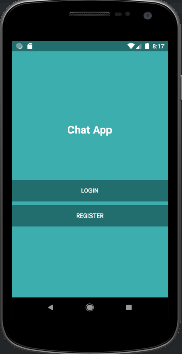

# Firebase Android Chat

> Preview



 


> Chat functions

* User registration
* User authorization
* Automatic login
* Reset password by email
* Sending a message
* Displaying message status
* User status display
* Change your user profile picture
* Receive new message notifications
* Search for users
* Grouping active chats
* Sign out of your account

> Libraries

```gradle

dependencies {

    implementation 'androidx.appcompat:appcompat:1.2.0'
    implementation 'com.google.android.material:material:1.3.0'
    implementation 'androidx.constraintlayout:constraintlayout:2.0.4'

    implementation 'androidx.legacy:legacy-support-v4:1.0.0'
    implementation 'com.google.android.material:material:1.3.0'
    implementation 'com.google.firebase:firebase-auth:20.0.4'
    implementation 'com.google.firebase:firebase-database:19.7.0'
    implementation 'com.google.firebase:firebase-core:18.0.3'
    implementation 'com.google.firebase:firebase-storage:19.2.2'
    implementation 'com.google.firebase:firebase-messaging:21.1.0'
    implementation 'androidx.cardview:cardview:1.0.0'
    implementation 'com.rengwuxian.materialedittext:library:2.1.4'
    implementation 'de.hdodenhof:circleimageview:2.2.0'
    implementation 'com.github.bumptech.glide:glide:4.8.0'
    implementation 'com.squareup.retrofit2:retrofit:2.3.0'
    implementation 'com.squareup.retrofit2:converter-gson:2.3.0'

    testImplementation 'junit:junit:4.13.2'
    androidTestImplementation 'androidx.test.ext:junit:1.1.2'
    androidTestImplementation 'androidx.test.espresso:espresso-core:3.3.0'

}

```

#### Getting Started

1. [Add Firebase to your Android Project.] (https://firebase.google.com/docs/android/setup)
2. Copy the google-services.json file you just downloaded into the app/ or mobile/ directory of your Android Studio project.
3. Select the Auth panel and then click the Sign In Method tab.
4. Click Google and turn on the Enable switch, then click Save
 


